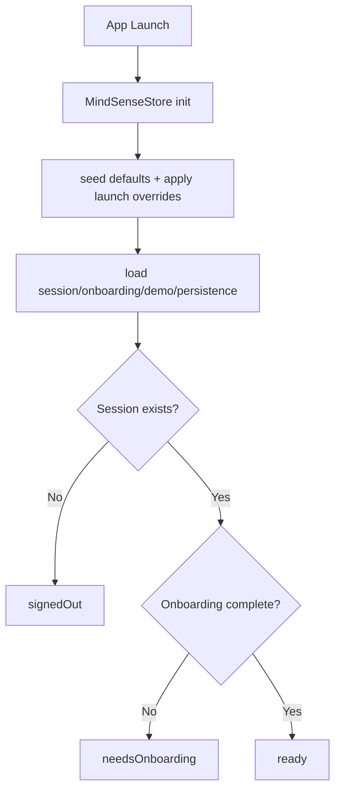
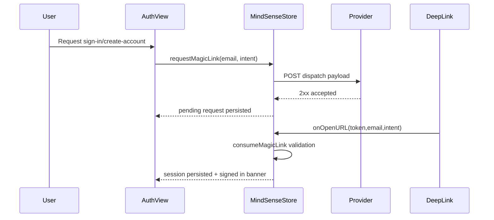

# MindSense Architecture Guide

This document explains the implemented runtime architecture of MindSense AI v1.0.0 and where key responsibilities live in the codebase.

## 1) High-level structure

MindSense is a local-first SwiftUI app with one primary state container (`MindSenseStore`) that coordinates:

- Launch routing
- Auth and onboarding
- Today/Regulate/Data state
- Local persistence
- Analytics event tracking

Core files:

- `MindSense-AI-v1.0.0/AppModel.swift`
- `MindSense-AI-v1.0.0/AppStateResolver.swift`
- `MindSense-AI-v1.0.0/MindSensePersistenceService.swift`
- `MindSense-AI-v1.0.0/MindSenseBootstrapService.swift`
- `MindSense-AI-v1.0.0/RecommendationEngine.swift`
- `MindSense-AI-v1.0.0/MindSenseDeltaEngine.swift`
- `MindSense-AI-v1.0.0/DemoHealthSignalEngine.swift`

## 2) App lifecycle and routing

`ContentView` chooses root surface using `AppStateResolver.rootRoute(...)`:

- `launching -> LaunchView`
- `signedOut + intro not seen -> IntroView`
- `signedOut + intro seen -> AuthView`
- `needsOnboarding -> OnboardingView`
- `ready -> MainShellView`

State machine:

## 3) Primary runtime surfaces

`MainShellView` wires three tabs:

- `TodayView`
- `RegulateView`
- `DataView`

Other implemented surfaces currently outside primary tab nav:

- `CommunityView`
- `QAToolsView`
- `KPIScorecardView` (via QA tools)

## 4) Domain engines and responsibilities

### `RecommendationEngine`

- Produces the primary suggested protocol (`Calm now`, `Focus prep`, `Sleep downshift`)
- Uses scenario + metrics + inferred stress/recovery/caffeine signals
- Computes projected load deltas for “what-if” previews

### `MindSenseDeltaEngine`

- Applies deterministic metric deltas for:
  - Session outcomes
  - Experiment check-ins
  - Experiment completion summaries
  - Fast-forward day simulation
- Generates effect metrics (heart-rate downshift, HRV shift, recovery slope)

### `DemoHealthSignalEngine`

- Seeds and refreshes simulated health profiles
- Tracks permissions, data quality diagnostics, timeline segments, and stress episodes
- Generates context-capture opportunities for recent episodes

## 5) Persistence model

`MindSensePersistenceService` uses `UserDefaults` + Codable models.

Persisted domains include:

- Auth/session + pending magic-link request
- Onboarding progress per email
- Active and historical regulate sessions
- Experiments and results
- Demo scenario/metrics/events/health profile/insights
- Analytics event buffer (bounded count and payload size)

Design constraints:

- Local-first by default
- Corrupt payloads fall back safely and raise user-facing recovery issues where needed
- Event history is bounded to avoid unbounded growth

## 6) Auth flow (magic-link)

Flow summary:

1. Validate email and cooldown.
2. Generate token + verification URL.
3. Dispatch POST request to configured provider endpoint.
4. Persist pending request locally.
5. Consume incoming deep/universal link.
6. Validate token/email/expiry against pending request.
7. Persist session and continue routing.

Sequence:

## 7) Onboarding and activation

Onboarding steps:

- `Connect Health`
- `Enable Notifications`
- `Start Baseline` (activation required)
- `First Check-in` (activation required)

Activation path is sequentially gated for required steps. Completion transitions app to `ready`.

## 8) Analytics model

Events are captured in-app as local records with:

- Event name
- Timestamp
- Optional surface/action metadata

Current implementation is local persistence only (no external analytics transport in this repo).

## 9) Test seams and determinism hooks

`MindSenseBootstrapService.applyLaunchOverridesIfNeeded` supports deterministic launches for UI tests:

- Reset persisted state
- Seed signed-in, onboarding-complete test user
- Seed scenario/metrics/events/experiments
- Set appearance, haptics, reduce-motion flags

See `Docs/TESTING.md` for command-level workflows.

