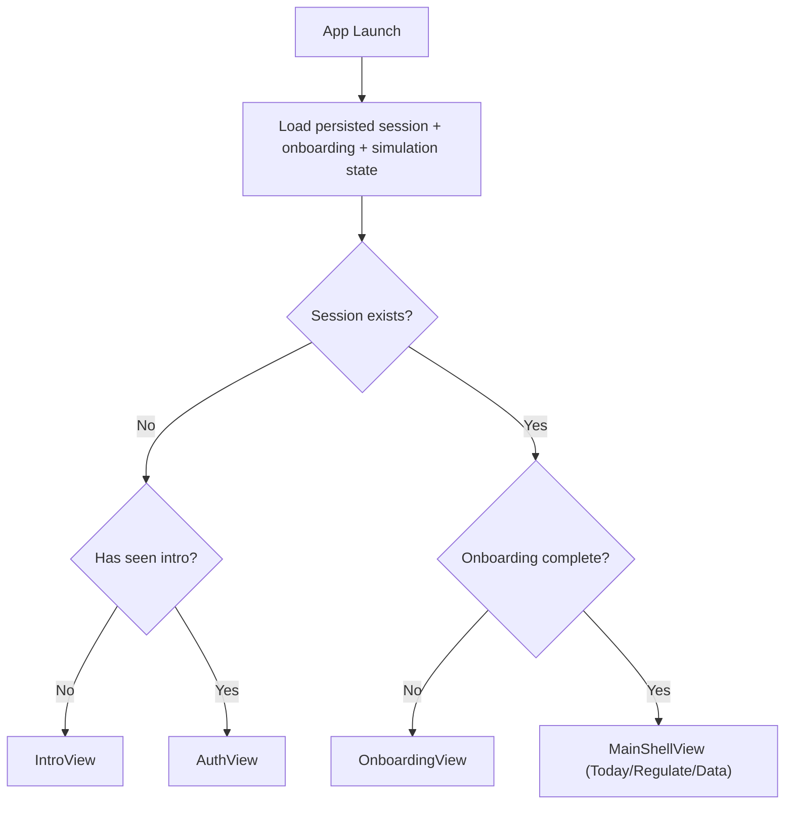
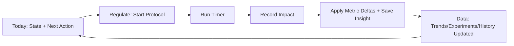

# MindSense AI v1.0.0 PRD (As-Built)

Version: 1.0 (as-built)
Date: February 19, 2026
Product: MindSense AI (iOS, SwiftUI)
App build metadata:
- `MARKETING_VERSION`: `1.0`
- `CURRENT_PROJECT_VERSION`: `1`
- Deployment target: `iOS 26.2`
- Targets: `MindSense-AI-v1.0.0`, `MindSense-AI-v1.0.0Tests`, `MindSense-AI-v1.0.0UITests`

## 1. Purpose Of This PRD

This document captures the **current implemented product** from source code, not an aspirational roadmap spec.

It defines:
- Actual user-facing behavior and flows.
- Domain rules and state transitions.
- Data model, persistence schema, and analytics.
- Quality gates and test coverage currently encoded in project scripts/tests.
- Known gaps between implemented modules and wired navigation.

## 2. Product Summary

MindSense AI is a local-first, scenario-driven nervous-system regulation app that provides:
- A current state snapshot (`Load`, `Readiness`, `Consistency`).
- One recommended next action (`Calm now`, `Focus prep`, `Sleep downshift`).
- A guided regulate session loop with post-session impact capture.
- Trend and experiment views that update model confidence and recommendation quality.

Core promise (from design/brand docs and reflected in UI structure):
- User should identify current state and one next action in under ~30 seconds.

Current implementation posture:
- Mostly simulated intelligence and simulated health signals.
- Passwordless email magic-link auth UX is implemented with local persistence and routing.
- External magic-link email dispatch is supported when a delivery endpoint is configured.
- No real HealthKit ingestion pipeline.
- No real billing/StoreKit purchase flow.

## 3. Product Goals And Non-Goals

### 3.1 Goals (implemented)
- Deliver a deterministic daily loop:
  - understand state -> run one regulate action -> capture outcome -> improve future recommendations.
- Keep IA focused on three core tabs:
  - `Today`, `Regulate`, `Data`.
- Maintain trust-forward framing:
  - confidence labels, data coverage, estimate language, and escalation guidance.
- Preserve premium UX constraints:
  - calm motion, clear hierarchy, one dominant CTA path, high readability.

### 3.2 Non-goals (current build)
- Real clinical diagnostics.
- Real-time medical monitoring.
- Cloud sync, multi-device account infrastructure.
- Live community feed.
- StoreKit subscriptions and receipt validation.

## 4. Primary Users (Inferred From UX + Logic)

### 4.1 Primary user
- Stress-exposed knowledge worker seeking short, actionable self-regulation steps.

### 4.2 Secondary users
- Product stakeholders validating deterministic UX narratives via scenario controls.
- QA/research users evaluating interaction quality and modeled recommendation behavior.

### 4.3 Jobs to be done
- “Tell me my state now and what to do next.”
- “Guide me through a short intervention.”
- “Show whether actions are helping over days.”
- “Help me spot what patterns are working.”

## 5. Information Architecture

Canonical IA labels:
- `Today`
- `Regulate`
- `Data`
- `Community`
- `Settings`
- `QA Tools`

Primary navigation actually wired in `MainShellView`:
- Tab 1: `Today`
- Tab 2: `Regulate`
- Tab 3: `Data`

Secondary navigation:
- Profile icon in top-right opens `Settings`.

Implemented but not currently wired into primary runtime navigation:
- `CommunityView`
- `QAToolsView`
- `KPIScorecardView` (reachable only from `QAToolsView`, which is itself unwired)

## 6. App Lifecycle And Launch Routing

`MindSenseStore` boot sequence:
- Seeds defaults (`MindSenseBootstrapService.seedDefaultsIfNeeded()`).
- Applies launch overrides for UI testing (`-uitest-*` flags).
- Loads local state from `UserDefaults` persistence service.
- Repairs corrupted local seeded data where needed.
- Resolves destination through `AppStateResolver`.

App launch state machine:
- `launching`
- `signedOut`
- `needsOnboarding`
- `ready`

Root route mapping:
- `launching` -> Launch screen.
- `signedOut` + intro not seen -> Intro.
- `signedOut` + intro seen -> Auth.
- `needsOnboarding` -> Onboarding.
- `ready` -> Main tab shell.

## 7. Functional Requirements By Surface

## 7.1 Intro

Purpose:
- Communicate product value and trust framing before auth.

Behavior:
- Shows three value highlights.
- CTA `Continue to email sign in` sets `hasSeenIntro = true`.
- Secondary “Restore purchase” currently shows informational banner only.

## 7.2 Auth

Modes:
- `Sign In`
- `Create Account`

Validation rules:
- Email must contain `@` and `.` and be length >= 5.
- Resend requests are cooldown-gated (`MINDSENSE_MAGIC_LINK_RESEND_COOLDOWN_SECONDS`, default 20s).

Auth data behavior:
- Uses passwordless email magic-link requests and deep-link verification.
- Requests can dispatch to a configured HTTP delivery endpoint (`MINDSENSE_MAGIC_LINK_REQUEST_URL` or derived from `MINDSENSE_MAGIC_LINK_API_BASE_URL`).
- Supabase provider mode is supported with direct `/auth/v1/otp` dispatch when configured.
- Persists pending link request state locally (`email`, `token`, `intent`, `requestedAt`, `expiresAt`, `verificationURL`).
- Supports resend and cancel of pending magic-link requests.
- On successful link consumption, app persists session email and routes forward.
- Debug preview completion is optional and build-config gated.

Magic-link configuration (env-driven):
- `MINDSENSE_MAGIC_LINK_PROVIDER`
- `MINDSENSE_MAGIC_LINK_API_BASE_URL`
- `MINDSENSE_MAGIC_LINK_REQUEST_URL`
- `MINDSENSE_MAGIC_LINK_SUPABASE_ANON_KEY` (required when using Supabase direct dispatch)
- `MINDSENSE_MAGIC_LINK_REDIRECT_SCHEME`
- `MINDSENSE_MAGIC_LINK_REDIRECT_HOST`
- `MINDSENSE_MAGIC_LINK_REDIRECT_PATH`
- `MINDSENSE_MAGIC_LINK_UNIVERSAL_HOST`
- `MINDSENSE_MAGIC_LINK_TTL_MINUTES`
- `MINDSENSE_MAGIC_LINK_RESEND_COOLDOWN_SECONDS`
- `MINDSENSE_MAGIC_LINK_DEBUG_SHOW_LINK_PREVIEW`
- `MINDSENSE_MAGIC_LINK_DEBUG_AUTO_OPEN`

## 7.3 Onboarding

Declared steps:
- `Connect Health`
- `Enable Notifications`
- `Start Baseline`
- `First Check-in`

Activation-gated required steps:
- `Start Baseline`
- `First Check-in`

Rules:
- Required steps are sequentially gated (`canComplete(step:)`).
- Baseline step sets `baselineStart` when first completed.
- First check-in stores `firstCheckInValue`.
- Completion transitions app to `ready` and fires onboarding completion analytics.

Escalation copy:
- If first check-in value >= 9, show sustained high-load escalation guidance.

## 7.4 Today (state + action surface)

Core modules:
- State command deck:
  - health source line
  - metric deltas (`Load Δ`, `Readiness Δ`, `Consistency Δ`)
  - interpretation line
  - expandable “Why this state”
- Best next step card:
  - recommended protocol
  - reason and expected effect
  - CTA to start protocol or resume active session
- Timeline block:
  - 12-hour stress/recovery segments
  - recent episode cards
  - episode detail access
- Context capture block (conditional):
  - appears for recent episodes without context
  - supports tags + free-text note
- Drivers block:
  - top ranked drivers + optional expanded/secondary signals
- Status snapshot:
  - current metric values + model details sheet
- Quick check-in:
  - load slider 0..10
  - save check-in CTA
  - escalation guidance shown on high load

Sheets:
- Model details (confidence, coverage, last updated).
- Signal source diagnostics (permissions, import freshness, data quality).
- Timeline details with day filter.
- Episode detail:
  - context save
  - attribution feedback (accurate/not accurate)
  - one-tap start recommended preset
  - cognitive reframing prompt (copyable)

Sticky bottom CTA:
- Visible when active session exists:
  - “Continue session” or “Record impact”.

Today primary output requirements:
- Show exactly one mapped next action path.
- Preserve access to diagnostics without replacing main action narrative.

## 7.5 Regulate (protocol execution surface)

Step model:
- Step 1: Select protocol.
- Step 2: Run timer.
- Step 3: Record impact.

Protocol catalog:
- Scenario-specific presets (ranked by recommendation logic/history):
  - `Calm now`
  - `Focus prep`
  - `Sleep downshift`

Session lifecycle:
- Start protocol -> create active session.
- Run countdown timer (1-second updates).
- Auto-transition to “awaiting check-in” when timer completes.
- Optionally cancel session.
- Capture post-session impact:
  - feeling score (1..5)
  - helpfulness (`yes|some|no`)
  - derived impact direction/intensity
  - predicted/measured effect metrics (`HR downshift`, `HRV shift`, `recovery slope`)
- Submit outcome:
  - updates metrics
  - appends history/event/insight
  - bumps demo day
  - may trigger post-activation paywall.

Tab bar behavior:
- Hidden while session is actively in progress.

Post-activation paywall:
- Presented once after first completed session unless already dismissed/seen.
- Actions:
  - `Maybe later`
  - `Start 7-day trial` (currently presentation-level only; no StoreKit transaction).

## 7.6 Data (analysis + experiments + history)

Workspace submodes:
- `Trends`
- `Experiments`
- `History`

Shared top modules:
- Workspace switcher.
- Current state block with recommended action shortcut.
- Signal trend tiles.

Trends submode:
- Window filter (`7D`, `14D`, `30D`).
- Readiness vs Load chart (interactive drag marker).
- Readout pills.
- Confidence/coverage pills.
- Insight narrative for selected focus.
- “See suggested plan” CTA maps into Regulate.

Experiments submode:
- Focus chips (`Readiness`, `Load`, `Consistency`).
- Context-focused 7-day experiment cards.
- Experiment statuses:
  - `planned`
  - `active`
  - `completed`
- CTA behavior:
  - planned -> start experiment
  - active (incomplete) -> log day
  - active (duration met) -> open completion sheet
  - completed -> no primary CTA
- Completion sheet captures perceived change and summary.

History submode:
- Weekly summary block:
  - wins
  - risks
  - next best action
- Recent activity timeline:
  - grouped by day labels
  - event-specific icons/tints.

What’s working block:
- Most effective protocol.
- Most common trigger.
- Best recovery window.

## 7.7 Settings

Sections:
- Profile.
- Account and access.
- Health and data.
- Notifications.
- Appearance and motion.
- Safety.

Key behaviors:
- Autosave every setting change (AppStorage/UserDefaults-backed).
- Tracks `setting_autosaved` analytics events.
- Sign out clears session and resets major local seeded state.
- Navigation into Apple Health permissions screen.
- Crisis call shortcut (`tel://988`).

Notification preferences:
- Gentle nudges.
- Weekly review.
- Smart stress nudge.
- Recovery window.
- Quiet hours enable + start/end times.

Appearance/motion:
- Appearance mode (`System`, `Light`, `Dark`).
- Reduce motion.
- Haptics.

Apple Health permissions screen (simulated diagnostics):
- Shows connection status and quality score.
- Displays permission checklist.
- Displays quality diagnostics bars.
- Actions:
  - Open Health app URL.
- Resync health data.
  - Rebuild derived baseline.
  - Delete health-derived data (with destructive confirmation).

## 7.8 Community (implemented, unwired)

Capabilities:
- Scenario-aware read-only drill-down cards.
- Safety moderation framing.
- Saved insights list.
- Crisis support shortcut.

Constraints:
- Simulated content only, no real feed/posting.
- Not reachable from primary app navigation in current wiring.

## 7.9 QA Tools (implemented, unwired)

Capabilities:
- Scenario switcher.
- Guided validation path controls (currently hidden by feature flag).
- Data mutation controls:
  - reset
  - fast-forward day
  - inject stress event
- KPI scorecard navigation (currently hidden by feature flag).

Constraints:
- Intended debug-only.
- Not reachable from primary app navigation in current wiring.

## 7.10 KPI Scorecard (implemented, secondary)

Capabilities:
- Renders core product KPI rates:
  - activation
  - D1 retention
  - D7 retention
  - session start rate
  - session completion rate
- Composite “portfolio health” score.
- Weekly review mark action.

Data source:
- Computed from local analytics event log only.

## 8. Core Product Loop

## 9. Domain Model And Rules

Key entities:
- `AuthSession`
- `OnboardingProgress`
- `DemoMetricSnapshot`
- `DemoEventRecord`
- `DemoSavedInsight`
- `RegulateSessionRecord`
- `SessionOutcome`
- `RegulateEffectMetrics`
- `Experiment`
- `AnalyticsEventRecord`
- `DemoHealthProfile`
- `StressEpisodeRecord`

Important domain rules:
- Metrics are clamped:
  - Load: 8..96
  - Readiness: 8..98
  - Consistency: 10..99
- Simulated day index (`demoDay`) is clamped:
  - 1..35
- Session/experiment histories are bounded:
  - session history: 50
  - event history: 80
  - analytics events: 2000
  - saved insights: 40

## 10. Recommendation, Confidence, And Simulation Logic

## 10.1 Scenario model

Scenarios:
- `High Stress Day`
- `Balanced Day`
- `Recovery Week`

Each scenario defines:
- Base metrics.
- Confidence baseline.
- Primary/secondary drivers.
- Preset catalog copy and protocol steps.
- Narrative and insight framing.
- Seed experiments/events/health profile.

## 10.2 Recommendation engine

Inputs:
- Scenario.
- Current metrics vs base metrics.
- Confidence score.
- Stress/recovery/caffeine signal counts.

Outputs:
- One `DemoRecommendation` with:
  - preset
  - what
  - why
  - expected effect (including 2h projected load shift)
  - time minutes.

Driver ranking:
- Adjusts base driver impact using context signal deltas and scenario-sensitive heuristics.
- Sorts descending by adjusted impact.

## 10.3 Metric delta engine

Deterministic deltas used for:
- Session outcomes.
- Experiment day logging.
- Completed experiments.
- Fast-forward day simulation.

Example:
- Better session outcome (`intensity = n`) -> `load -= 2n`, `readiness += 2n`, `consistency += 1`.

## 10.4 Confidence model

Coverage score combines:
- Event coverage (35%).
- Check-in coverage (25%).
- Session coverage (25%).
- Experiment coverage (15%).

Confidence score starts from scenario base and adjusts with:
- Coverage factor.
- Whether today’s primary loop was completed.
- Active experiment adherence.
- Cancellation penalty.

Confidence output:
- Label: `Strong` / `Moderate` / `Emerging`.
- Percent displayed in Today/Data diagnostics.

## 10.5 Trend generation

`trendPoints(window)` synthesizes readiness/load timeseries using:
- Scenario volatility constants.
- Anchor metrics.
- Drift over selected window.
- Sin/cos wave modulation.
- Simulated day adjustment (`demoDay`).
- Completed session/experiment impacts.

Windows:
- `7D`: 21 points, 8-hour step.
- `14D`: 28 points, 12-hour step.
- `30D`: 30 points, 24-hour step.

## 10.6 Health signal engine (simulated)

Generates:
- Permission states.
- Data quality breakdown.
- Stress episodes.
- 12-hour timeline segments.

Refresh behavior:
- Quality adjusts with session completion, experiment adherence, and load/readiness conditions.
- Injects generated episodes when no recent episode exists.
- Supports explicit operations:
  - resync
  - rebuild derived profile
  - delete derived profile.

## 11. Persistence Model (UserDefaults)

Storage strategy:
- Entirely local `UserDefaults` with JSON encoding for structured objects.
- No encryption layer beyond platform defaults.

Major keys:
- Session/auth:
  - `auth.fallback_session_email`
  - `auth.magic_link.pending.v1`
- Intro/onboarding:
  - `hasSeenIntro`
  - `onboarding.progress.<email>`
  - `onboarding.started_at.v1`
- Regulate:
  - `regulate.session.active.v1`
  - `regulate.session.history.v1`
- Experiments/analytics:
  - `data.experiments.v1`
  - `analytics.events.v1`
- Demo state:
  - `demo.scenario.v1`
  - `demo.metrics.v1`
  - `demo.events.v1`
  - `demo.health_profile.v1`
  - `demo.saved_insights.v1`
  - `demo.day.v1`
  - `demo.last_updated.v1`
  - `demo.guided_path.step.v1`
- Monetization/KPI:
  - `paywall.post_activation.seen`
  - `kpi.last_reviewed_at.v1`
- Appearance/motion/haptics:
  - `appearanceMode`
  - `appReduceMotion`
  - `enableHaptics`
- Notification prefs:
  - `notifications.gentlePrompts`
  - `notifications.weeklyReview`
  - `notifications.stressNudge`
  - `notifications.recoveryWindow`
  - `notifications.quietHoursEnabled`
  - `notifications.quietStartMinutes`
  - `notifications.quietEndMinutes`

Corruption handling:
- Decode failures return fallback values and set a data issue message.
- `retryCoreScreen` repairs by resetting to seeded `Balanced Day` defaults.

## 12. Analytics Taxonomy

Tracked surfaces:
- `intro`, `auth`, `onboarding`, `today`, `regulate`, `data`, `community`, `settings`, `global`

Tracked events:
- `app_opened`
- `screen_view`
- `navigation_tab_changed`
- `primary_cta_tapped`
- `secondary_action_tapped`
- `action_completed`
- `chart_interaction`
- `setting_autosaved`
- `onboarding_completed`
- `onboarding_step_completed`
- `onboarding_drop_off` (defined but not currently emitted in audited flows)
- `session_started`
- `session_outcome_recorded`
- `experiment_started`
- `experiment_day_logged`
- `experiment_completed`
- `paywall_presented`
- `paywall_dismissed`
- `kpi_reviewed`

Analytics storage:
- Local event ring (max 2000 events).
- Event metadata includes explicit timestamp string and optional surface/action fields.

## 13. Feature Flags And Launch Controls

Runtime feature flags:
- `demoControlsEnabled`
  - Currently hard-disabled (`false`).
- `communityEnabled`, `kpiScorecardEnabled`, `guidedPathEnabled`
  - Currently hard-disabled (`false`).

UI test launch controls:
- `-uitest-reset`
- `-uitest-ready`
- `-uitest-system | -uitest-light | -uitest-dark`
- `-uitest-enable-haptics 0|1`
- `-uitest-reduce-motion 0|1`

`-uitest-ready` seeds deterministic post-onboarding local simulation state and scenario.

## 14. UX, Accessibility, And Quality Gates

Design intent anchors (implemented docs/tokens):
- Tone: calm, factual, directive.
- Hierarchy: hero signal -> primary action -> detail.
- Motion: short ease-out transitions, reduce-motion support.
- Surfaces: tokenized `base/raised/glass/focus`.

Accessibility and quality instrumentation:
- Contrast audit script: `Scripts/contrast_audit.swift`.
- Copy budget lint: `Scripts/copy_budget_lint.sh`.
- Screenshot + quality gate orchestration: `Scripts/design_qa.sh`.
- UI tests include dynamic type (`AXXXL`) and interaction latency budgets.

Performance budget currently encoded in UI tests:
- Tab transition max observed target `< 750ms` (simulator budget).
- Primary action to state change target `< 750ms`.

## 15. Testing Coverage (Current)

Unit tests:
- `AppStateResolverTests`:
  - route transitions and onboarding gating behavior.
- `RecommendationEngineTests`:
  - scenario recommendation selection, projected delta behavior, driver ranking order.
- `MindSenseDeltaEngineTests`:
  - deterministic delta calculations and clamping.
- `DemoHealthSignalEngineTests`:
  - seeded profile validity, refresh behavior, derived-data deletion behavior.

UI tests (`MindSenseCoreScreensUITests`):
- Core screen navigation and CTA flows.
- Deterministic Today->Regulate loop.
- 7-day experiment lifecycle.
- Snapshot matrix (system/light/dark).
- Dynamic type scaling assertions.
- Interaction latency report generation.

## 16. Security, Privacy, And Compliance Posture

Current posture:
- Data is local-only and mostly simulated.
- Auth uses local fallback session + local pending magic-link persistence, with optional network dispatch for magic-link email delivery.
- No PHI transport pipeline and no network sync path in audited code.
- Crisis/support messaging is informational; app explicitly frames itself as non-emergency support.

Known compliance constraints in current state:
- No cryptographic hardening of persisted user defaults payloads.
- Privacy policy URL currently points to placeholder `https://example.com/privacy`.

## 17. Known Gaps And Risks

Product and wiring gaps:
- `Community`, `QA Tools`, and `KPI Scorecard` are implemented but not reachable from primary runtime navigation.
- Guided path flow references opening QA Tools from profile flow, but no route is currently wired for that action.

Integration gaps:
- No real HealthKit integration (diagnostics are currently simulated).
- No push/local notification scheduling despite settings toggles.
- No backend auth/session infrastructure.
- No StoreKit billing flow behind post-activation paywall.

Data and trust risks:
- User data stored in plain `UserDefaults` payloads.
- KPI metrics are derived from local analytics events, not backend truth.

Testing consistency risk (static inspection):
- Some UI test identifiers and expected labels appear out of sync with currently visible control IDs/text in source, indicating potential stale tests or stale assumptions.

## 18. Release Scope Definition (As Of This Build)

Core shipped surfaces:
- `Launch`
- `Intro`
- `Auth`
- `Onboarding`
- `Today`
- `Regulate`
- `Data`
- `Settings`
- `Post-activation paywall sheet`

Debug/latent surfaces:
- `Community`
- `QATools`
- `KPI Scorecard`

## 19. Recommended Next Product Milestones

1. Navigation integrity milestone:
- Wire or intentionally remove latent screens (`Community`, `QATools`, `KPI`) for release clarity.
- Resolve guided-path dead-end references.

2. Real integration milestone:
- Replace fallback auth with production auth backend.
- Implement HealthKit read pipeline and permission sync.
- Implement notification scheduling logic respecting quiet hours.

3. Monetization readiness milestone:
- Replace informational paywall with StoreKit products/trial handling.
- Add subscription state persistence and entitlement gating.

4. Data trust milestone:
- Harden local storage strategy for sensitive fields.
- Add explicit data export/delete workflow implementation behind current placeholders.

5. Testing convergence milestone:
- Reconcile UI test identifiers with actual source IDs and CTAs.
- Run Phase 6 quality gates in CI on every release candidate.

---

Appendix A: Primary code anchors used for this PRD:
- `/Users/ekosanmi.j/Documents/MindSense-AI-v1.0.0/MindSense-AI-v1.0.0/AppModel.swift`
- `/Users/ekosanmi.j/Documents/MindSense-AI-v1.0.0/MindSense-AI-v1.0.0/AppStateResolver.swift`
- `/Users/ekosanmi.j/Documents/MindSense-AI-v1.0.0/MindSense-AI-v1.0.0/RecommendationEngine.swift`
- `/Users/ekosanmi.j/Documents/MindSense-AI-v1.0.0/MindSense-AI-v1.0.0/MindSenseDeltaEngine.swift`
- `/Users/ekosanmi.j/Documents/MindSense-AI-v1.0.0/MindSense-AI-v1.0.0/DemoHealthSignalEngine.swift`
- `/Users/ekosanmi.j/Documents/MindSense-AI-v1.0.0/MindSense-AI-v1.0.0/MindSensePersistenceService.swift`
- `/Users/ekosanmi.j/Documents/MindSense-AI-v1.0.0/MindSense-AI-v1.0.0/Features/Shell/TodayView.swift`
- `/Users/ekosanmi.j/Documents/MindSense-AI-v1.0.0/MindSense-AI-v1.0.0/Features/Shell/RegulateView.swift`
- `/Users/ekosanmi.j/Documents/MindSense-AI-v1.0.0/MindSense-AI-v1.0.0/Features/Shell/DataView.swift`
- `/Users/ekosanmi.j/Documents/MindSense-AI-v1.0.0/MindSense-AI-v1.0.0/Features/Shell/SettingsView.swift`
- `/Users/ekosanmi.j/Documents/MindSense-AI-v1.0.0/MindSense-AI-v1.0.0/Features/Shell/CommunityView.swift`
- `/Users/ekosanmi.j/Documents/MindSense-AI-v1.0.0/MindSense-AI-v1.0.0/Features/Shell/QAToolsView.swift`
- `/Users/ekosanmi.j/Documents/MindSense-AI-v1.0.0/MindSense-AI-v1.0.0Tests/*.swift`
- `/Users/ekosanmi.j/Documents/MindSense-AI-v1.0.0/MindSense-AI-v1.0.0UITests/MindSenseCoreScreensUITests.swift`
- `/Users/ekosanmi.j/Documents/MindSense-AI-v1.0.0/Docs/Phase-1-Brand-Direction.md`
- `/Users/ekosanmi.j/Documents/MindSense-AI-v1.0.0/Docs/Phase-2-Design-System-v2.md`
- `/Users/ekosanmi.j/Documents/MindSense-AI-v1.0.0/Docs/Phase-6-Quality-Gates.md`
